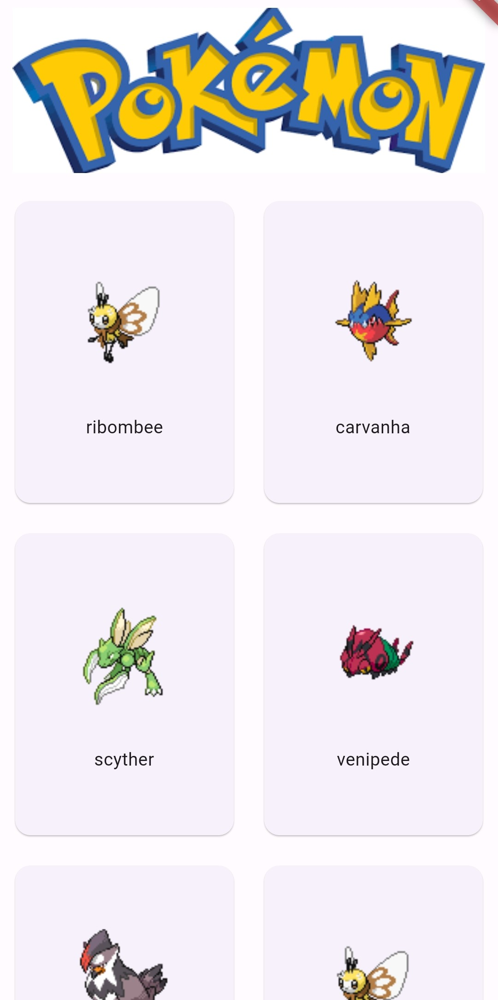
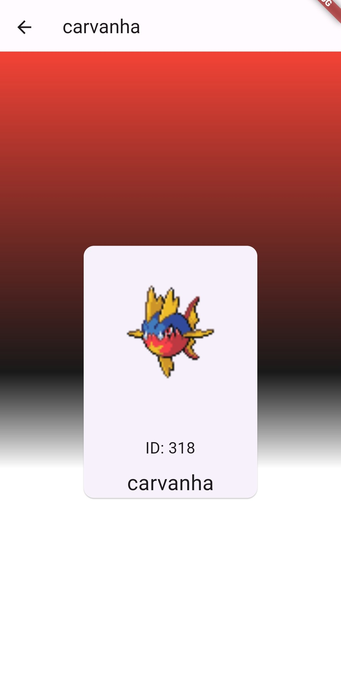

# Pokemon-Card
> Toy Project: Learning State Management with Flutter GetX

    

        
    

    

        
    

    

        <iframe width="100%" height="auto" src="assets/images/pokemon_app.mp4" frameborder="0" allowfullscreen></iframe>
    

